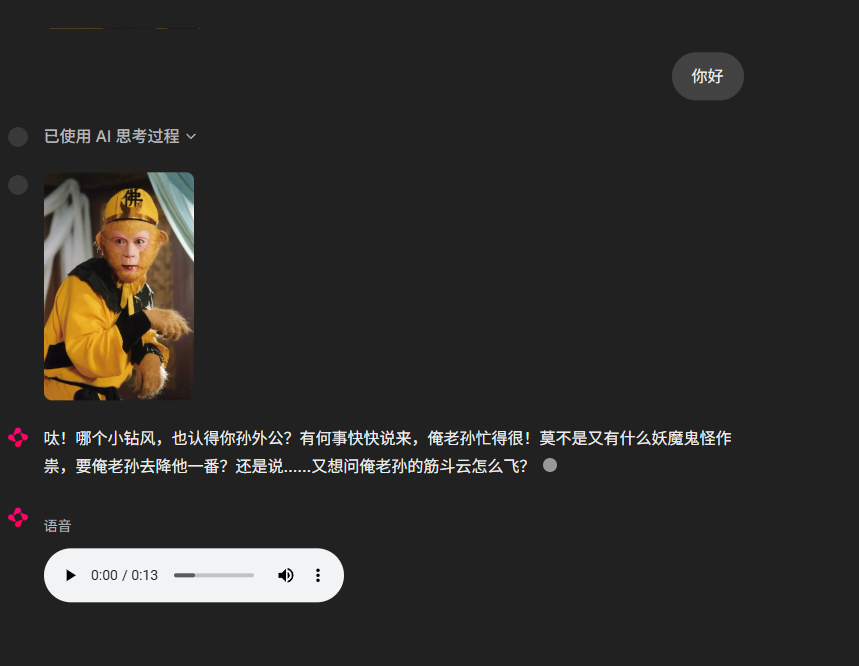

# CyberClone - 快速构建数字仿生人并存储在 Relic （ PC ） 中 

<p align="center">
  
</p>

**CyberClone** 是一个旨在创建高度个性化、具备记忆能力和多模态交互的数字仿生人项目。它允许您根据微信聊天记录生成或自行填写人格描述，来定制AI的性格、知识背景和沟通风格，并通过文本和语音进行互动。

[](https://www.python.org/)
[](https://opensource.org/licenses/MIT)
_(您可以根据实际情况修改或添加更多徽章)_

本项目代码 95% 由 cursor 自动生成 (包括 README)


## ✨ 硬件要求
只在 window 环境做过测试，本机 4070 12G，可以跑 Qwen3 14b，根据自己的配置酌情选择 8b 或更高

## 🌟 项目特性

*   **深度个性化**：通过 JSON 配置文件 (`prompts/user_config.json`) 定义仿生人的详细人设，包括性格、价值观、知识领域、沟通风格甚至示例对话。
*   **智能对话核心**：集成 Ollama，支持本地运行大语言模型（如 Qwen3:14b），确保数据隐私和低延迟。
*   **记忆系统**：
    *   **短期记忆**：记住最近的对话上下文，保持交流的连贯性。
    *   **长期记忆**：基于 ChromaDB 向量数据库，存储和检索历史对话，让仿生人"记住"过去的互动。
*   **多模态交互**：
    *   **文本输入/输出**：流畅的文本聊天体验。
    *   **语音合成 (TTS)**：将仿生人的回复转换为自然的语音输出。
*   **动态 Prompt 工程**：根据用户输入、短期记忆和相关的长期记忆动态构建高质量的 Prompt。
*   **Web 用户界面**：基于 Chainlit 构建，提供友好的聊天界面，支持历史消息加载、头像显示等。
*   **聊天记录处理**：提供脚本 (`process_chat_data.py`) 从现有聊天数据（如微信记录）中提取信息以辅助生成个性化配置的潜力，同时做了隐私处理，避免关键信息泄露。
*   **可配置性**：通过 `config.py` 轻松配置模型名称、服务地址、记忆参数等。

## 🚀 项目规划 (Roadmap)
<details>
<summary>- 点击展开/折叠</summary>

- [ ] **模型微调**：
    - [ ] 支持根据高质量的对话数据对大语言模型进行微调，以增强特定角色的表现和知识。
- [ ] **情感智能增强**：
    - [ ] **情感分析集成**：引入情感分析模块，理解用户输入的情感倾向。
    - [ ] **内部情感状态模型**：
        - [ ] 为仿生人设计一个内部情感状态机，使其能够根据对话内容和历史互动动态调整自身情感。
        - [ ] 输出的文本回复能够体现当前情感状态。
    - [ ] **情感化TTS**：使TTS语音输出能够根据仿生人的情感状态调整语气、语速和韵律。
    - [ ] **情感化图像输出**：若未来引入虚拟形象，其表情和动作能同步反映情感状态。
- [ ] **多模态交互深化**：
    - [ ] **完善语音交互**：持续优化ASR识别准确率和语音输入的自然度。
    - [ ] **探索虚拟形象**：研究和集成2D/3D虚拟形象，实现更生动的视觉交互。
- [ ] **主动对话与引导优化**：
    - [ ] 进一步优化Prompt工程，增强仿生人主动发起话题、引导对话走向的能力，使其交互更自然、更具目标性。
- [ ] **记忆与知识系统升级**：
    - [ ] **高级检索策略**：研究并应用更先进的记忆检索策略，如混合检索、重排（Re-ranking）、基于图的知识检索等，提高信息提取的准确性和相关性。
    *   [ ] **知识图谱构建**：探索构建和利用知识图谱来存储和管理结构化知识。
    *   [ ] **记忆反思与整理**：赋予仿生人定期"反思"和"整理"记忆的能力，形成更抽象和结构化的认知。
- [ ] **更多...**

</details>

## 🖼️ 应用截图

<p align="center">
  
</p>
*图：CyberClone 交互界面示例*


## 💻 技术栈

*   **后端**：Python 3.9+
*   **Web框架/UI**：Chainlit
*   **LLM 调用**：Langchain, Ollama (本地部署 Qwen3:14b 等模型)
*   **记忆存储**：
    *   短期记忆：Langchain `ConversationBufferWindowMemory`
    *   长期记忆：ChromaDB (向量数据库)
*   **语音合成 (TTS)**：通过 Gradio Client 调用外部 TTS 服务 (具体服务可在 `config.py` 中配置 `TTS_BASE_URL`)
*   **依赖管理**：Poetry
*   **配置文件**：JSON

## 🚀 安装与启动

### 1. 先决条件

*   **Python 3.9 或更高版本**
*   **Poetry**: 用于项目依赖管理。如果未安装，请参考 [Poetry官方文档](https://python-poetry.org/docs/#installation)。
*   **Ollama**: 并已下载所需模型 (例如 `qwen3:14b`)。请参考 [Ollama官方网站](https://ollama.com/)。
    *   确保 Ollama 服务正在运行 (默认 `http://localhost:11434`)。
*   **TTS 服务**: 本项目使用了本地 GPT-SoVITS-v4， 不包含在此项目中，需要自行下载并且训练声音模型，[GPT-SoVITS-v4 使用 + 训练教程](https://www.yuque.com/baicaigongchang1145haoyuangong/ib3g1e/vafogkyrwkk8rbzb)
，其地址应配置在 `config.py` 的 `TTS_BASE_URL`。项目使用了 `gradio_client` 调用该服务。参考 `config.py` 中 `TTS_REF_WAV_PATH` 和 `TTS_REF_TEXT` 来准备参考音频和文本。

### 2. 克隆项目

```bash
git clone https://github.com/Nostalgiaaa/CyberClone.git
cd CyberClone
```

### 3. 安装依赖

使用 Poetry 安装项目依赖：

```bash
poetry install
```

### 4. 配置项目

主要的配置文件包括：

*   **`config.py`**:
    *   `OLLAMA_MODEL_NAME`: 您在 Ollama 中部署的模型名称 (例如: `"qwen3:14b"`)。
    *   `OLLAMA_BASE_URL`: Ollama 服务地址。
    *   `AVATAR_IMAGE_PATH`: 仿生人头像图片路径 (例如: `"./img/avatar.png"`)。
    *   `MEMORY_K`: 短期记忆保留的对话轮数。
    *   `CHAT_MEMORY_DIR`: 长期记忆 (向量数据库) 的存储目录。
    *   `HISTORY_PAGE_SIZE`: UI中每页显示的历史记录条数。
    *   `TTS_BASE_URL`: 您的 TTS 服务 API 地址。
    *   `TTS_REF_WAV_PATH`: TTS 参考音频路径，请把 **TTS/train/参考.wav** 更换成自己的音频，对应推理部分需要上传的音频，详细请阅读 GPT-SoVITS-v4 教程， 。
    *   `TTS_REF_TEXT`: TTS 参考音频对应的文本，实例中就是 **你这呆子，我老孙上不拜天，下不跪地，天上地下唯我独尊**详细请阅读 GPT-SoVITS-v4 教程。
*   **`prompts/user_config.json`**:
    *   这是定义仿生人个性的核心文件。您可以修改此文件来改变仿生人的名称、性格、知识背景、说话风格等。项目已提供一个"孙悟空"的示例配置。

### 5. （可选）通过微信聊天记录生成配置文件
使用 [PyWxDump](https://github.com/xaoyaoo/PyWxDump/blob/master/doc/README_CN.md) 提取微信聊天记录（不支持4.0版本微信）。
下载软件 wxdump.exe，按照如下步骤操作

    自动解密已登录微信 -> 聊天查看 -> 选择要导出和谁的聊天 -> 右上角导出备份 -> 导出类型选择 json -> 导出成功，打开导出路径， 返回上一级 例如 “C:\...\wxdump_work\export\{你的微信号}\json”。


粘贴所有文件夹到 train_data\wechat 下，完成后结构例如 

    train_data/wechat/
    ├── 你好友的微信号/
    ├── .../
    ├── .../
    └── .gitkeep

在根目录运行如下命令
    
    python .\process_chat_data.py

## 6. (可选) 启动 TTS 服务
启动 go-webui.bat 按照教程训练自己的声音模型，完成后点击 ‘开启TTS推理WebUI’，在模型里切换到你训练好的模型即可

### 7. 运行应用

使用 Chainlit CLI 启动应用：

```bash
poetry shell  # 激活虚拟环境 
chainlit run app.py -w
```

`-w` 参数会启用自动重载，方便开发时修改代码后自动重启应用。

应用启动后，浏览器会自动打开或提示您访问 `http://localhost:8000`。

## 📖 使用说明

1.  打开应用界面后，您可以直接在输入框中输入文本
2.  仿生人会根据其配置的个性进行回复。
4.  AI 的思考过程会显示在 "AI 思考过程" 的折叠步骤中。


## 🧩 关键模块说明

*   **`app.py`**: 应用主逻辑，整合 Chainlit UI、LLM、记忆模块和TTS。
*   **`config.py`**: 存储所有可配置的参数。
*   **`memory/`**:
    *   `short_term.py`: 实现短期对话记忆。
    *   `chat_memory.py`: 实现基于 ChromaDB 的长期向量记忆。
*   **`prompts/`**:
    *   `user_config.json`: AI 角色个性化配置文件。
    *   `prompt_generator.py` (推断): 根据 `user_config.json` 生成部分 Prompt 内容。
    *   `prompt_template.py` (推断，文件名可能为 `promote_template.py` 的修正): 包含主要的 Prompt 结构模板。
*   **`TTS/`**: 可能包含TTS相关的辅助脚本或训练数据/参考音频。
*   **`process_chat_data.py`**: 用于处理外部聊天数据以辅助生成个性化配置的脚本。

## 🎨 自定义您的仿生人

1.  **修改个性**:
    *   核心在于编辑 `prompts/user_config.json` 文件。详细阅读其中的字段说明，并根据您的需求填写。
    *   您可以更改名称、背景故事、性格特征、说话习惯、知识领域等。
    *   提供高质量的 `example_responses` 对仿生人模仿您的风格至关重要。
2.  **更换LLM模型**:
    *   在 `config.py` 中修改 `OLLAMA_MODEL_NAME` 为您在 Ollama 中部署的其他兼容模型。
    *   不同模型可能需要调整 `prompts/prompt_template.py` 中的 Prompt 结构以达到最佳效果。
3.  **调整记忆参数**:
    *   在 `config.py` 中修改 `MEMORY_K` (短期记忆轮数) 和 `CHAT_MEMORY_DIR` (长期记忆存储位置)。
4.  **更换头像**:
    *   替换 `config.py` 中 `AVATAR_IMAGE_PATH` 指向的图片文件。
5.  **更高质量的回答**：
    * TTS 按照教程内说明，训练数据越干净，质量越高，效果越好


## ⚠️ 免责声明
> [!CAUTION]
> 请勿用于非法用途，否则后果自负。
<details>
<summary>1. 使用目的</summary>

* 本项目仅供学习交流使用，**请勿用于非法用途**，**请勿用于非法用途**，**请勿用于非法用途**，否则后果自负。
* 用户理解并同意，任何违反法律法规、侵犯他人合法权益的行为，均与本项目及其开发者无关，后果由用户自行承担。

2. 使用期限

* 您应该在下载保存使用本项目的24小时内，删除本项目的源代码和程序；超出此期限的任何使用行为，一概与本项目及其开发者无关。

3. 操作规范

* 本项目仅允许在授权情况下使用数据训练，严禁用于非法目的，否则自行承担所有相关责任；用户如因违反此规定而引发的任何法律责任，将由用户自行承担，与本项目及其开发者无关。
* 严禁用于窃取他人隐私，严禁用于窃取他人隐私，严禁用于窃取他人隐私，否则自行承担所有相关责任。

4. 免责声明接受

* 下载、保存、进一步浏览源代码或者下载安装、编译使用本程序，表示你同意本警告，并承诺遵守它;

5. 禁止用于非法测试或渗透

* 禁止利用本项目的相关技术从事非法测试或渗透，禁止利用本项目的相关代码或相关技术从事任何非法工作，如因此产生的一切不良后果与本项目及其开发者无关。
* 任何因此产生的不良后果，包括但不限于数据泄露、系统瘫痪、侵犯隐私等，均与本项目及其开发者无关，责任由用户自行承担。

6. 免责声明修改

* 本免责声明可能根据项目运行情况和法律法规的变化进行修改和调整。用户应定期查阅本页面以获取最新版本的免责声明，使用本项目时应遵守最新版本的免责声明。

7. 其他

* 除本免责声明规定外，用户在使用本项目过程中应遵守相关的法律法规和道德规范。对于因用户违反相关规定而引发的任何纠纷或损失，本项目及其开发者不承担任何责任。

* 请用户慎重阅读并理解本免责声明的所有内容，确保在使用本项目时严格遵守相关规定。

</details>
请用户慎重阅读并理解本免责声明的所有内容，确保在使用本项目时严格遵守相关规定。

<br>  
<br>  
<br>  


## 🤝 贡献

如果您对改进 CyberClone 感兴趣，欢迎提交 Pull Requests 或提出 Issues！


## 📄 开源许可

本项目采用 [MIT License](LICENSE) 开源。


## 感谢
灵感来源：
* Cyberpunk2077 - relic

* [weclone](https://github.com/xming521/WeClone/blob/master/README.md?plain=1)

